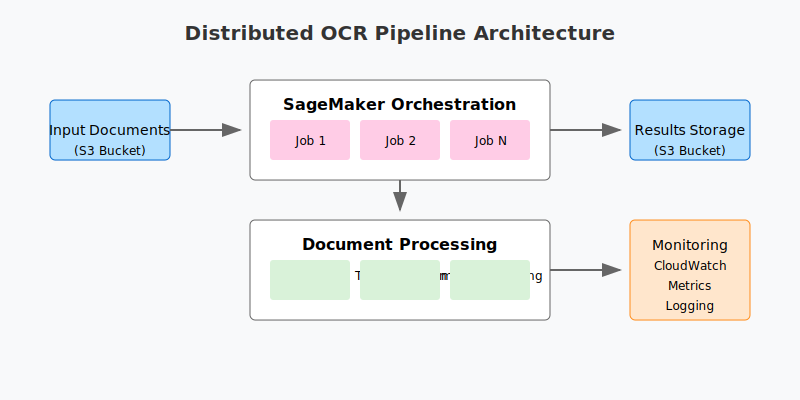

# Distributed Processing Pipeline with AWS SageMaker

A scalable, distributed processing pipeline built with AWS SageMaker. This modular framework supports various document processing tasks (OCR, image processing, text analysis, etc.) and can be easily extended with custom processors.



## Table of Contents
- [Features](#features)
- [Project Structure](#project-structure)
- [Prerequisites](#prerequisites)
- [Installation](#installation)
- [Configuration](#configuration)
- [Usage](#usage)
- [Adding New Processors](#adding-new-processors)
- [Local Development](#local-development)
- [Infrastructure](#infrastructure)
- [Testing](#testing)
- [Monitoring](#monitoring)
- [Contributing](#contributing)
- [License](#license)

## Features

### Core Features
- **Modular Architecture**
  - Pluggable processor framework
  - Easy extension with custom processors
  - Common interface for all processors
  - Built-in validation and error handling

### Available Processors
- **OCR Processing**
  - PDF to text conversion
  - Image text extraction
  - Multi-page document support
  
- **Image Processing**
  - Format conversion
  - Image optimization
  - Batch processing support

- **Text Analysis**
  - Text extraction
  - Content analysis
  - Metadata generation

### Infrastructure Features
- **Distributed Processing**
  - Automatic workload distribution
  - Parallel processing
  - Resource optimization
  
- **AWS Integration**
  - SageMaker Processing Jobs
  - S3 storage integration
  - CloudWatch monitoring
  - ECR container registry

## Project Structure

```
distributed-processing-pipeline/
├── src/
│   ├── config/               # Configuration management
│   │   ├── settings.py
│   │   └── local_settings.py
│   │
│   ├── processors/          # Processing modules
│   │   ├── base.py         # Base processor class
│   │   ├── ocr_processor.py
│   │   └── image_processor.py
│   │
│   ├── orchestration/      # Pipeline orchestration
│   │   └── pipeline.py
│   │
│   └── utils/             # Utility functions
│
├── tests/                 # Test suite
│   ├── unit/
│   └── integration/
│
├── infrastructure/        # Infrastructure code
│   ├── docker/
│   └── terraform/
│
├── docs/                 # Documentation
└── examples/            # Usage examples
```

## Prerequisites

### System Requirements
- Python 3.9+
- Docker
- AWS CLI
- Terraform (optional, for infrastructure deployment)

### AWS Requirements
- AWS Account
- IAM user with appropriate permissions
- S3 bucket for document storage
- SageMaker execution role

### Required Permissions
```json
{
    "Version": "2012-10-17",
    "Statement": [
        {
            "Effect": "Allow",
            "Action": [
                "s3:GetObject",
                "s3:PutObject",
                "s3:ListBucket",
                "sagemaker:CreateProcessingJob",
                "sagemaker:DescribeProcessingJob",
                "logs:CreateLogGroup",
                "logs:CreateLogStream",
                "logs:PutLogEvents"
            ],
            "Resource": "*"
        }
    ]
}
```

## Installation

1. Clone the repository:
```bash
git clone https://github.com/yourusername/distributed-processing-pipeline.git
cd distributed-processing-pipeline
```

2. Create and activate virtual environment:
```bash
python -m venv venv
source venv/bin/activate  # Linux/Mac
# or
.\venv\Scripts\activate  # Windows
```

3. Install the package:
```bash
make install
```

4. Configure AWS credentials:
```bash
aws configure
```

## Configuration

### AWS Configuration
```python
@dataclass
class AWSConfig:
    region: str = "us-west-2"
    bucket: str = "my-processing-bucket"
    role_arn: str = "arn:aws:iam::ACCOUNT:role/SageMakerExecutionRole"
    instance_type: str = "ml.t3.xlarge"
    max_parallel_jobs: int = 10
    files_per_job: int = 10
```

### Processor Configuration
```python
@dataclass
class ProcessorConfig:
    type: str = "ocr"  # or "image", "text", etc.
    output_format: str = "parquet"
    batch_size: int = 10
    custom_settings: Dict[str, Any] = field(default_factory=dict)
```

## Usage

### Basic Usage

1. Initialize Pipeline:
```python
from distributed_pipeline import ProcessingPipeline
from distributed_pipeline.config import AWSConfig, ProcessorConfig

# Create configurations
aws_config = AWSConfig(
    region="us-west-2",
    bucket="my-bucket",
    role_arn="my-role-arn"
)
processor_config = ProcessorConfig()

# Initialize pipeline
pipeline = ProcessingPipeline(aws_config, processor_config)

# Register processors
pipeline.register_processor("ocr", OCRProcessor)
pipeline.register_processor("image", ImageProcessor)
```

2. Run Processing:
```python
# Run OCR processing
pipeline.run_processor(
    "ocr",
    input_prefix="s3://bucket/documents/",
    output_type="text"
)

# Run image processing
pipeline.run_processor(
    "image",
    input_prefix="s3://bucket/images/",
    output_format="png"
)
```

## Adding New Processors

### Step 1: Create Processor Class

```python
# src/processors/custom_processor.py
from typing import Any, Dict
from .base import BaseProcessor

class CustomProcessor(BaseProcessor):
    def __init__(self, config: Dict[str, Any] = None):
        super().__init__(config)
        self.specific_setting = config.get('specific_setting', 'default')
    
    def validate_input(self, input_data: Any) -> bool:
        # Add validation logic
        return True
    
    def process(self, input_data: Any) -> Any:
        # Add processing logic
        return processed_result
```

### Step 2: Add Configuration

```python
@dataclass
class CustomProcessorConfig:
    specific_setting: str = "default"
    processing_mode: str = "standard"
    batch_size: int = 10
```

### Step 3: Create Tests

```python
# tests/processors/test_custom_processor.py
def test_custom_processor():
    processor = CustomProcessor({"specific_setting": "test"})
    result = processor.process(test_data)
    assert result is not None
```

### Step 4: Register and Use

```python
# Register processor
pipeline.register_processor("custom", CustomProcessor)

# Use processor
pipeline.run_processor(
    "custom",
    input_prefix="s3://bucket/data/",
    specific_setting="value"
)
```

## Local Development

### Setup Local Environment

1. Configure local settings:
```python
from config.local_settings import LocalAWSConfig

local_config = LocalAWSConfig(
    endpoint_url="http://localhost:8080",
    use_local_mode=True
)
```

2. Start local SageMaker:
```bash
make local-setup
```

3. Run local tests:
```bash
make local-test
```

## Infrastructure

### Build and Deploy

1. Build Docker image:
```bash
make build-image
```

2. Deploy infrastructure:
```bash
cd infrastructure/terraform
terraform init
terraform apply
```

## Testing

### Running Tests

```bash
# Run all tests
make test

# Run specific tests
pytest tests/unit/test_processor.py

# Run with coverage
pytest --cov=src tests/
```

### Writing Tests

```python
def test_processor():
    processor = CustomProcessor()
    
    # Test validation
    assert processor.validate_input(valid_data)
    
    # Test processing
    result = processor.process(test_data)
    assert result.status == "success"
```

## Monitoring

### CloudWatch Integration

1. Access logs:
```bash
aws logs get-log-events \
    --log-group-name /aws/sagemaker/ProcessingJobs \
    --log-stream-name your-job-name
```

2. Monitor metrics:
- Processing time
- Error rates
- Resource usage
- Job status

## Contributing

1. Fork the repository
2. Create feature branch
3. Commit changes
4. Push to branch
5. Create Pull Request

### Development Guidelines

1. Follow code style:
   - Use Black for formatting
   - Add type hints
   - Write docstrings
   - Include tests

2. Testing:
   - Add unit tests
   - Update integration tests
   - Verify local execution

## License

This project is licensed under the MIT License - see the [LICENSE](LICENSE) file for details.

---

## Quick Start Guide

1. Install:
```bash
git clone https://github.com/yourusername/distributed-processing-pipeline.git
cd distributed-processing-pipeline
make install
```

2. Configure:
```bash
cp .env.example .env
# Edit .env with your settings
```

3. Run:
```python
from distributed_pipeline import ProcessingPipeline
pipeline = ProcessingPipeline()
pipeline.run_processor("ocr", "s3://bucket/documents/")
```

For more examples, check the [examples](examples/) directory.