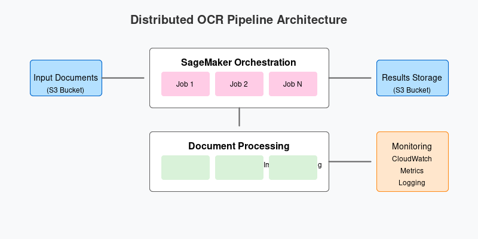

# Distributed OCR Pipeline with AWS SageMaker

A scalable, distributed OCR (Optical Character Recognition) pipeline built with AWS SageMaker for processing large volumes of documents efficiently. This project demonstrates how to leverage SageMaker's processing jobs to distribute workload across multiple instances, process documents using Tesseract OCR, and manage the entire pipeline efficiently.



## Table of Contents
- [Features](#features)
- [Project Structure](#project-structure)
- [Prerequisites](#prerequisites)
- [Installation](#installation)
- [Configuration](#configuration)
- [Usage](#usage)
  - [Basic Usage](#basic-usage)
  - [Local Development](#local-development)
  - [Production Deployment](#production-deployment)
- [Development](#development)
- [Testing](#testing)
- [Infrastructure](#infrastructure)
- [Monitoring](#monitoring)
- [Troubleshooting](#troubleshooting)
- [Contributing](#contributing)
- [License](#license)

## Features

- **Distributed Processing**
  - Automatic workload distribution across multiple SageMaker instances
  - Configurable parallel processing jobs
  - Efficient resource utilization

- **Flexible Document Processing**
  - PDF document processing
  - Image to text conversion
  - Support for multiple output formats
  - Configurable OCR settings

- **AWS Integration**
  - Seamless S3 integration
  - SageMaker Processing Jobs
  - CloudWatch monitoring
  - IAM role management

- **Developer Features**
  - Local development mode
  - Comprehensive testing suite
  - Infrastructure as Code
  - Detailed logging and monitoring

## Project Structure

```
distributed-ocr-pipeline/
├── src/
│   ├── config/           # Configuration management
│   ├── core/            # Core processing logic
│   ├── orchestration/   # Pipeline orchestration
│   └── utils/           # Utility functions
├── tests/
│   ├── unit/
│   ├── integration/
│   └── data/            # Test data
├── infrastructure/
│   ├── docker/
│   └── terraform/
├── scripts/
├── docs/
└── examples/
```

## Prerequisites

### System Requirements
- Python 3.9+
- Docker
- AWS CLI
- Terraform (optional, for infrastructure deployment)

### AWS Requirements
- AWS Account
- IAM user with appropriate permissions
- S3 bucket for document storage
- SageMaker execution role

### Required Permissions
```json
{
    "Version": "2012-10-17",
    "Statement": [
        {
            "Effect": "Allow",
            "Action": [
                "s3:GetObject",
                "s3:PutObject",
                "s3:ListBucket",
                "sagemaker:CreateProcessingJob",
                "sagemaker:DescribeProcessingJob",
                "logs:CreateLogGroup",
                "logs:CreateLogStream",
                "logs:PutLogEvents"
            ],
            "Resource": "*"
        }
    ]
}
```

## Installation

1. Clone the repository:
```bash
git clone https://github.com/yourusername/distributed-ocr-pipeline.git
cd distributed-ocr-pipeline
```

2. Create and activate virtual environment:
```bash
python -m venv venv
source venv/bin/activate  # Linux/Mac
# or
.\venv\Scripts\activate  # Windows
```

3. Install the package:
```bash
make install
```

4. Configure AWS credentials:
```bash
aws configure
```

## Configuration

### AWS Configuration

```python
# src/config/settings.py
@dataclass
class AWSConfig:
    region: str = "us-west-2"
    bucket: str = "my-ocr-bucket"
    role_arn: str = "arn:aws:iam::ACCOUNT:role/SageMakerExecutionRole"
    instance_type: str = "ml.t3.xlarge"
    max_parallel_jobs: int = 10
    files_per_job: int = 10
```

### OCR Configuration

```python
@dataclass
class OCRConfig:
    output_format: str = "parquet"
    partition_key: str = "document_id"
    tesseract_config: Optional[dict] = None
```

### Environment Variables
```bash
export AWS_PROFILE=default
export AWS_REGION=us-west-2
export SAGEMAKER_ROLE_ARN=arn:aws:iam::ACCOUNT:role/SageMakerExecutionRole
export OCR_BUCKET_NAME=my-ocr-bucket
```

## Usage

### Basic Usage

1. Python API:
```python
from distributed_ocr_pipeline import OCRPipeline
from distributed_ocr_pipeline.config import AWSConfig, OCRConfig

# Initialize pipeline
pipeline = OCRPipeline(
    aws_config=AWSConfig(),
    ocr_config=OCRConfig()
)

# Process documents
pipeline.run(input_prefix="documents/")
```

2. Command Line:
```bash
python -m distributed_ocr_pipeline.main \
    --input-prefix documents/ \
    --output-type both \
    --max-parallel-jobs 5
```

### Local Development

1. Start local SageMaker environment:
```bash
make local-setup
```

2. Run local tests:
```bash
make local-test
```

3. Monitor local processing:
```bash
make local-logs
```

### Production Deployment

1. Build Docker image:
```bash
make build-image
```

2. Deploy infrastructure:
```bash
make deploy
```

3. Run pipeline:
```bash
make run-pipeline INPUT_PREFIX=s3://bucket/documents/
```

## Development

### Setting Up Development Environment

1. Install development dependencies:
```bash
pip install -e ".[dev]"
```

2. Install pre-commit hooks:
```bash
pre-commit install
```

### Code Style
The project uses:
- Black for code formatting
- isort for import sorting
- mypy for type checking
- pylint for linting

Run style checks:
```bash
make format  # Format code
make lint    # Run linters
```

## Testing

### Running Tests

```bash
# All tests
make test

# Specific test
pytest tests/unit/test_processor.py -v

# With coverage
pytest --cov=src tests/
```

### Writing Tests

```python
def test_document_processor():
    processor = DocumentProcessor(output_type="both")
    result = processor.process_document(
        "test.pdf",
        document_id="test123"
    )
    assert "text" in result
    assert "image_paths" in result
```

## Infrastructure

### Local Docker Build

```bash
# Build local image
docker build -t ocr-processor:local -f infrastructure/docker/Dockerfile.local .

# Run local container
docker run -it --rm \
    -v ~/.aws:/root/.aws \
    -v $(pwd)/data:/opt/ml/data \
    ocr-processor:local
```

### AWS Deployment

1. Infrastructure setup:
```bash
cd infrastructure/terraform
terraform init
terraform plan
terraform apply
```

2. Verify deployment:
```bash
aws sagemaker list-processing-jobs
```

## Monitoring

### CloudWatch Logs

Access logs:
```bash
aws logs get-log-events \
    --log-group-name /aws/sagemaker/ProcessingJobs \
    --log-stream-name your-job-name
```

### Metrics

Key metrics available in CloudWatch:
- DocumentsProcessed
- ProcessingTime
- ErrorRate
- InstanceUtilization

### Alerts

Configure CloudWatch alarms:
```bash
aws cloudwatch put-metric-alarm \
    --alarm-name OCRPipelineError \
    --metric-name ErrorRate \
    --threshold 5
```

## Troubleshooting

### Common Issues

1. SageMaker Permission Errors
   - Check IAM role permissions
   - Verify S3 bucket access
   - Review CloudWatch logs

2. Processing Errors
   - Validate input documents
   - Check Tesseract configuration
   - Monitor instance resources

3. Infrastructure Issues
   - Verify AWS credentials
   - Check resource limits
   - Review deployment logs

### Debug Mode

Enable debug logging:
```python
import logging
logging.getLogger('distributed_ocr_pipeline').setLevel(logging.DEBUG)
```

### Support

For support:
1. Check documentation
2. Review CloudWatch logs
3. Open GitHub issue
4. Contact maintainers

## Contributing

1. Fork repository
2. Create feature branch
3. Commit changes
4. Push to branch
5. Create Pull Request

### Development Guidelines

1. Follow code style guides
2. Add tests for new features
3. Update documentation
4. Write clear commit messages

## License

This project is licensed under the MIT License - see the [LICENSE](LICENSE) file for details.

---

## Quick Start Guide

1. Install:
```bash
git clone https://github.com/yourusername/distributed-ocr-pipeline.git
cd distributed-ocr-pipeline
make install
```

2. Configure:
```bash
cp .env.example .env
# Edit .env with your settings
```

3. Run:
```python
from distributed_ocr_pipeline import OCRPipeline
pipeline = OCRPipeline()
pipeline.run("documents/")
```

For more examples, check the [examples](examples/) directory.